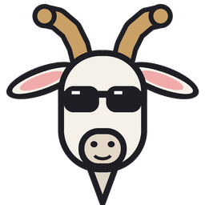
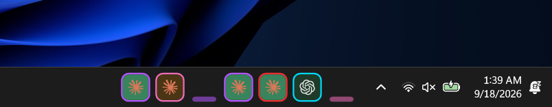
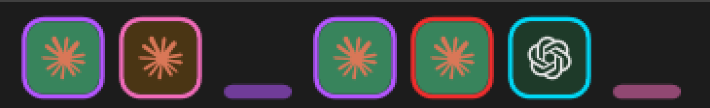
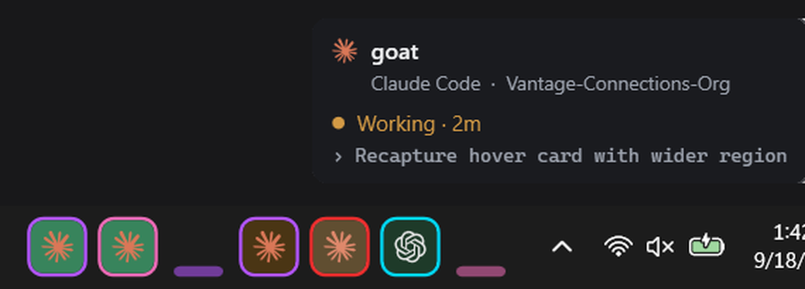

<p align="center">
  
</p>

<h1 align="center">AgentBar</h1>

<p align="center">
  <b>Every Claude Code and Codex chat you have running, as a row of squares in your Windows taskbar.</b><br>
  See which agents are working, which are done, and jump to one with a click.
</p>

<p align="center">
  
</p>

---

## What you get

<p align="center">
  
</p>

One square per chat, sitting in the empty part of your taskbar next to the tray.

- **Background = status.** Glance at the taskbar instead of cycling through terminals.
- **Border = the chat's colour.** For Claude Code that's the chat's own `/color`, so the square matches its prompt bar. Codex chats (and Claude chats without a colour) get a fixed colour of their own.
- **Logo = the tool.** Claude Code or Codex.
- **Idle chats shrink to a thin bar** so the chats that matter stand out. Hover one and it pops back to a full square.

| Background | Meaning |
|---|---|
| 🟫 Dull orange | Working. No need to look. |
| 🟩 Green | Done, waiting on you. Stays green until you click it. |
| Dim green | Done, and you've already looked. Fades to idle after 30 min of no activity. |
| 🟦 Blue | Needs an answer: a permission prompt or a question (requires the [optional hook](#optional-live-step-and-needs-an-answer)). |
| Thin bar | Idle. |

### Hover for details, click to jump

<p align="center">
  
</p>

- **Hover** a square for the chat's name, tool and folder, its status and elapsed time, and what it's doing right now.
- **Click** to bring that chat's window (Zed, Windows Terminal, VS Code, Cursor, …) to the front. A green square turns dim green once you've looked.
- **Drag** squares to reorder them. The order is remembered.
- **Right-click** the bar or the tray icon for a menu with *Hide bar*, a *Start with Windows* switch, *Mark all finished as seen* and *Quit*.
- **Tray icon:** click the goat in the system tray to show or hide the bar. Hovering it shows a count (e.g. "5 chats, 2 done, 1 working"), and right-clicking it opens the same menu. A hidden bar stays hidden across restarts until you show it again. Windows puts new tray icons in the <code>^</code> overflow at first, so drag the goat onto the taskbar to keep it visible.

## Install

Requires Windows 10/11 with the taskbar at the bottom, and the [.NET 8 SDK](https://dotnet.microsoft.com/download/dotnet/8.0) to build (`winget install Microsoft.DotNet.SDK.8`).

```powershell
git clone https://github.com/Vantage-Connections-Org/agentbar
cd agentbar
.\install.ps1 -StartWithWindows
```

This builds a single ~330 KB `AgentBar.exe` into `%LOCALAPPDATA%\AgentBar`, adds a Start menu shortcut, and starts it. Launch it again any time from Start → **AgentBar**. Only one copy ever runs. `.\uninstall.ps1` removes it all.

**That's it.** AgentBar finds your chats on its own. No configuration needed.

## How it works

AgentBar reads the files each tool already keeps about its own chats. It needs no API keys and no network, and never modifies Claude Code's or Codex's files:

| | Finds running chats from | Status | Name |
|---|---|---|---|
| **Claude Code** | `~/.claude/sessions/<pid>.json` (checked against the live process) | `busy` / `idle` from the same file | Your `/rename`, else the auto-generated title in the chat transcript |
| **Codex** | `~/.codex/thread-writer-locks/<id>.lock`, held open while a chat is live | `task_started` / `task_complete` in the chat's rollout log | `~/.codex/session_index.jsonl` |

To bring a chat's window forward, it walks up the process tree from the agent to the app hosting its terminal, then picks that app's window whose title names the chat's folder.

The bar is a small WPF window owned by the taskbar, so it stays above it. Windows 11 has no official way to add things to the taskbar.

## Optional: live step and "needs an answer"

Without hooks, AgentBar already shows working / done / idle for every chat. Adding the included hook also shows **the step the agent is on** in the hover card, and turns a square **blue** when a chat is waiting for your answer.

**Claude Code:** add this to `~/.claude/settings.json`, replacing `<you>`:

```json
{
  "hooks": {
    "SessionStart": [{ "hooks": [{ "type": "command", "command": "node \"C:\\Users\\<you>\\AppData\\Local\\AgentBar\\hooks\\agent-status.js\" start claude" }] }],
    "PreToolUse":   [{ "matcher": "", "hooks": [{ "type": "command", "command": "node \"C:\\Users\\<you>\\AppData\\Local\\AgentBar\\hooks\\agent-status.js\" tool claude" }] }],
    "PostToolUse":  [{ "matcher": "AskUserQuestion", "hooks": [{ "type": "command", "command": "node \"C:\\Users\\<you>\\AppData\\Local\\AgentBar\\hooks\\agent-status.js\" toolDone claude" }] }],
    "Notification": [{ "hooks": [{ "type": "command", "command": "node \"C:\\Users\\<you>\\AppData\\Local\\AgentBar\\hooks\\agent-status.js\" ask claude" }] }]
  }
}
```

**Codex:** add this to `~/.codex/hooks.json`. Codex asks you to trust new hooks once.

```json
{
  "hooks": {
    "SessionStart": [{ "hooks": [{ "type": "command", "command": "node \"C:\\Users\\<you>\\AppData\\Local\\AgentBar\\hooks\\agent-status.js\" start codex" }] }],
    "PostToolUse":  [{ "hooks": [{ "type": "command", "command": "node \"C:\\Users\\<you>\\AppData\\Local\\AgentBar\\hooks\\agent-status.js\" tool codex" }] }]
  }
}
```

The `start` hook also launches AgentBar if it isn't running. Hooks need [Node.js](https://nodejs.org). If you installed AgentBar somewhere else, set `AGENTBAR_EXE` to the exe's path.

## Tip: give every chat its own colour

Claude Code's `/color` also works as a starting prompt, so a PowerShell function can give every new chat a random prompt-bar colour, and AgentBar's border picks it up:

```powershell
function c {
  if ($args.Count) { claude @args; return }   # only one starting prompt is allowed
  $colors = 'red','blue','green','yellow','purple','orange','pink','cyan'
  claude "/color $($colors | Get-Random)"
}
```

## Limitations

- **Windows only**, with the taskbar at the bottom of the primary monitor.
- **Clicking focuses the window, not the terminal tab.** If several chats share one editor window, you land in that window and pick the tab yourself. Zed has no way for other apps to switch its terminal tabs.
- It reads files Claude Code and Codex write for their own use. Those aren't public APIs, so a future release of either tool could change them.

## Development

```powershell
dotnet run --project src          # run from source
dotnet publish src -c Release -r win-x64 --self-contained false -p:PublishSingleFile=true -o out
cd art; py make_goat.py            # redraw the icon (needs Pillow)
```

`src/Discovery.cs` finds the chats, `src/BarWindow.cs` draws the bar and handles hover, drag and click, and `src/Native.cs` holds the Win32 calls.

## Credits

Claude and OpenAI logos from [Simple Icons](https://simpleicons.org) (CC0). Both are trademarks of their owners, and this project isn't affiliated with Anthropic or OpenAI.

## License

[MIT](LICENSE) © 2026 Vantage Connections
